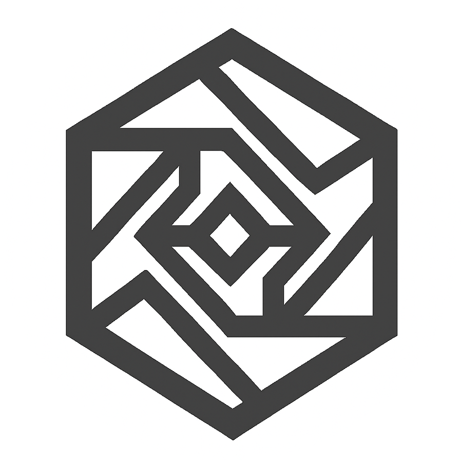

<div align="center">

  

  # Srmap API

  **A modern, blazing-fast full-stack portal and utility suite for SRM AP students.**

  <p align="center">
    <a href="https://srmapi.in"><strong>Explore the Web App »</strong></a>
    <br />
    <br />
    <a href="#-key-features">Key Features</a> •
    <a href="#-tech-stack">Tech Stack</a> •
    <a href="#-getting-started">Getting Started</a> •
    <a href="#-available-commands">Commands</a> •
    <a href="#-architecture--documentation">Documentation</a>
  </p>

  <p align="center">
    
    
    
    
    
    
    
  </p>
</div>

---

## Features

| Feature | Description |
| :--- | :--- |
| **Attendance** | Accurate attendance calculation, detailed logs, bunks and future attendance calculations, and OD/ML adjustment support. |
| **Detailed Timetable** | Interactive weekly schedule with real-time "current class" tracker and classroom navigation. |
| **Examinations & Results** | Instant internal assessment marks, historical semester records, and exam ledger CGPA lookup. |
| **Vacant Classrooms** | Automated empty room finder filtering by block, day of the week, and active time slot. |
| **Built-in CAPTCHA Solver** | In-house Node.js TFLite neural solver solving portal CAPTCHA. |
| **Multi-Account Storage** | Upto 5 switchable student accounts. |
| **Academic Resources** | Static syllabus, course resources, and downloadable subject reference materials. |
| **Offline & Cached Mode** | Student portal offline fallback allowing students to access attendance & schedules even when SRM servers are down. |

---

## Tech Stack

<div align="center">
  
</div>

<br/>

- **Frontend & App Framework:** [Next.js 16 (App Router)](https://nextjs.org/) + [React 19](https://react.dev/)
- **Styling & UI Components:** [Tailwind CSS](https://tailwindcss.com/) + [Radix UI](https://www.radix-ui.com/) + [Lucide Icons](https://lucide.dev/)
- **Machine Learning / AI:** [TensorFlow.js (TFLite Runtime)](https://www.tensorflow.org/js) + [Sharp](https://sharp.pixelplumbing.com/)
- **Database & Cache:** [MongoDB](https://www.mongodb.com/) with native driver connection pooling
- **PWA & Service Worker:** [Serwist (@serwist/next)](https://serwist.pages.dev/)
- **HTTP Client & Parsing:** [Axios](https://axios-http.com/) + [Cheerio](https://cheerio.js.org/) + [Tough-Cookie](https://github.com/salesforce/tough-cookie)

---

## Getting Started

### Prerequisites

Ensure you have the following installed on your machine:
- **Node.js**: `v22.0.0` or higher
- **npm**: `v10.0.0` or higher
- **MongoDB**: Local MongoDB instance (`mongodb://127.0.0.1:27017`) or MongoDB Atlas URI

### 📦 Installation

1. **Clone the repository:**
   ```bash
   git clone https://github.com/StoreVia/srmapi.next.git
   cd srmapi.next
   ```

2. **Install project dependencies:**
   ```bash
   npm install
   ```

3. **Configure Environment Variables:**
   Create a `.env` file in the root directory:
   ```env
   NODE_ENV=development
   MONGO_URI="mongodb://127.0.0.1:27017"
   ACCESS_SECRET="your-ultra-secure-random-jwt-signing-secret"
   ACCESS_EXPIRE=365
   D_REPORT="https://discord.com/api/webhooks/your-webhook-url"
   ```

4. **Run the Development Server:**
   ```bash
   npm run dev
   ```

5. **Open in Browser:**
   Navigate to [http://localhost:3000](http://localhost:3000) to access Srmapi Next.

---

## Available Commands

| Command | Action | Description |
| :--- | :--- | :--- |
| `npm run dev` | `next dev` | Starts Next.js development server with hot-reload. |
| `npm run build` | `next build --webpack` | Compiles and optimizes production application build. |
| `npm run start` | `next start` | Runs optimized production server on port 3000. |
| `npm run lint` | `next lint` | Executes ESLint rules and syntax checks. |
| `npm run faculty` | `node convertFacultyExcelToJson.js` | Parses faculty Excel spreadsheets into static JSON. |

---

## Architecture & Documentation

For comprehensive technical architecture, data scraping workflows, cryptographic models, database schemas, and complete API endpoint specifications:

👉 **Read the full guide: [workflow.md](workflow.md)**

```
srmapi.next/
├── src/
│   ├── app/           # Next.js App Router (Public, Protected, API Routes)
│   ├── components/    # Reusable UI Primitives & Feature-specific Dialogs
│   ├── context/       # Auth, Student Data, and Account Contexts
│   ├── hooks/         # Custom React hooks (Timetable, Toast, Navigation)
│   ├── lib/           # MongoDB singleton, Axios client, CAPTCHA solver
│   ├── server/        # SRM scrapers, HTML parsers, auth & session logic
│   ├── static/        # TFLite model, academic calendar, faculty records
│   └── shared/        # Universal utilities & retry helpers
├── public/            # PWA manifests, icons, static assets
└── workflow.md        # Detailed system workflow & API reference
```

---

<div align="center">
  <sub>Built with ❤️ for SRM AP students. Not affiliated with or endorsed by SRM University.</sub>
</div>