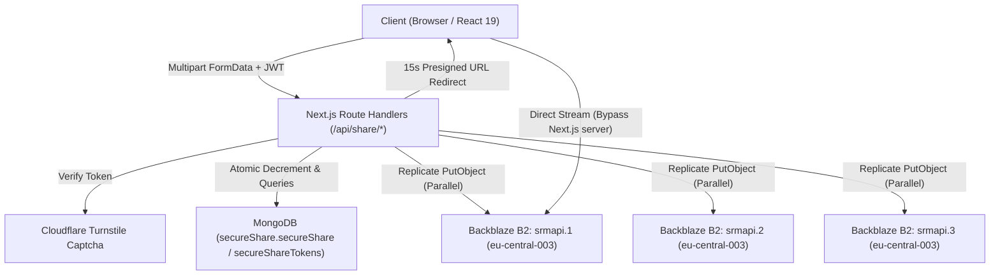
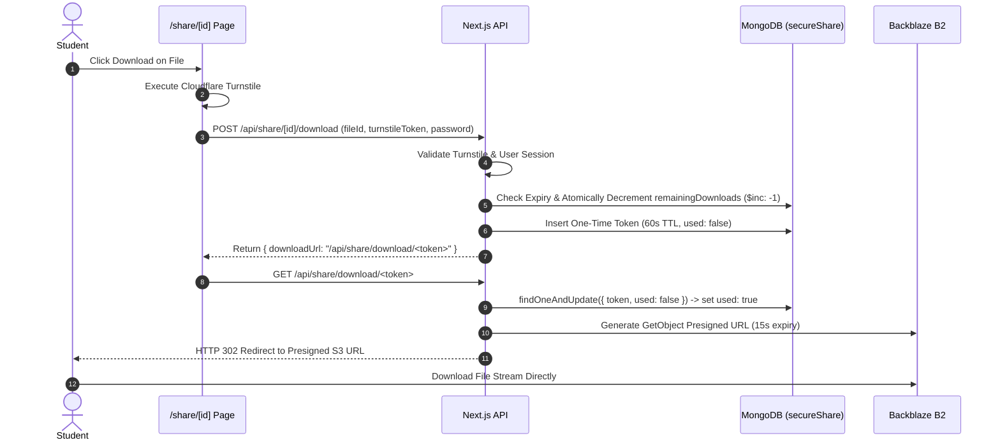

# Secure Share Architecture and Workflow

Secure Share is an ephemeral, access-controlled file and text sharing subsystem built into Srmapi Next. It lets students transfer text and files with access policies, password verification, time-based and count-based expiration, storage quotas, and Backblaze B2 replica uploads. Secure Share does not encrypt file or text content at the application level.

## Contents

- [System Architecture](#system-architecture)
- [Core Security Model](#core-security-model)
- [Storage and Quota Model](#storage-and-quota-model)
- [Database Schema and Indices](#database-schema-and-indices)
- [Upload and Replication Workflow](#upload-and-replication-workflow)
- [Download and Single-Use Token Workflow](#download-and-single-use-token-workflow)
- [Purge and Expiration Mechanics](#purge-and-expiration-mechanics)
- [Backend API Reference](#backend-api-reference)
- [Administrative Controls](#administrative-controls)
- [Source Map](#source-map)

## System Architecture



The subsystem decouples file binary streaming from Next.js server resources. File binaries are never served directly by Node.js web worker threads during download. Instead, downloads are offloaded to Backblaze B2 presigned S3 URLs after authentication and rate verification.

## Core Security Model

1. **Authentication Enforcement**:
   - Share creation requires a valid user JWT.
   - File downloads require an active student session regardless of whether a share is public or private.
   - Text contents for public shares can be previewed without login; file downloads remain locked to authenticated users.

2. **Access Control Types**:
   - **Public**: Any logged-in student can download the attached files.
   - **Private (Restricted Registration Numbers)**: The share is configured with an allowed-registration-number list. Without a password, only the creator and listed students can access it; a password-protected private share also accepts a valid password.
   - **Password Protected**: The supplied password is stored only as a PBKDF2-SHA-256 hash (100,000 iterations and a unique 16-byte salt). The server uses a timing-safe comparison before revealing permitted content or issuing download tokens. This verifies access; it does not encrypt file or text content.

3. **Bot and Abuse Mitigation**:
   - Every file download attempt requires passing a Cloudflare Turnstile CAPTCHA challenge before the backend generates an access token.

4. **Single-Use Ephemeral Download Tokens**:
   - When a download is approved, the backend generates a cryptographically random 32-byte hexadecimal token with a 60-second time-to-live.
   - Consuming the token `/api/share/download/[token]` atomically sets `used: true`. Any attempt to reuse, refresh, or share the link returns an HTTP 410 Gone response.

## Storage and Quota Model

- **Per-User Active Storage Cap**: 10 MB (`10 * 1024 * 1024` bytes) total active storage per student.
- **Maximum Files Per Share**: Up to 20 files per share payload.
- **Maximum Share Lifetime**: Configurable from 1 to 120 minutes.
- **Maximum Downloads Limit**: Configurable to 1, 5, or 10 total successful downloads.
- **Quota Calculation**: Active quota is computed by aggregating `totalBytes` across all unexpired shares created by the user in `secureShare.secureShare`. Expired shares are excluded from the user's quota.

## Database Schema and Indices

Data is stored in the `secureShare` MongoDB database across two collections:

> Deployment migration: set `SECURE_SHARE_MONGO_URI` before deploying this version and copy existing share records from the former `forums` database first. `FORUMS_MONGO_URI` remains a temporary connection-string fallback only; it does not make the application read the former `forums` database.

### 1. `secureShare` Collection

```typescript
interface ShareDocument {
    _id?: ObjectId;
    shareId: string;
    creatorUsername: string;
    text?: string;
    files: Array<{
        fileId: string;
        name: string;
        size: number;
        type: string;
        s3Key: string;
    }>;
    totalBytes: number;
    isPublic: boolean;
    allowedRegNos: string[];
    isPasswordProtected: boolean;
    passwordHash?: string;
    passwordSalt?: string;
    maxDownloads: number;
    remainingDownloads: number;
    expiresAt: Date;
    purgeAfter: Date;
    createdAt: Date;
}
```

Indices configured:
- `{ expiresAt: 1 }` and `{ purgeAfter: 1 }` ordinary indexes. They must not be TTL indexes because the document contains the B2 keys needed for hard deletion.
- `{ shareId: 1 }` with `{ unique: true }`.
- `{ creatorUsername: 1 }`.
- `{ allowedRegNos: 1 }`.

### 2. `secureShareTokens` Collection

```typescript
interface DownloadTokenDocument {
    _id?: ObjectId;
    token: string;
    shareId: string;
    fileId: string;
    s3Key: string;
    filename: string;
    username: string;
    used: boolean;
    expiresAt: Date;
    createdAt: Date;
}
```

Indices configured:
- `{ expiresAt: 1 }` with `{ expireAfterSeconds: 0 }`.
- `{ token: 1 }` with `{ unique: true }`.

## Upload and Replication Workflow

1. The client validates total selected file sizes against the remaining 10 MB quota and sends `multipart/form-data` to `POST /api/share/create`.
2. The server authenticates the JWT, sanitizes filenames, and validates input parameters.
3. For each attached file:
   - A unique 6-byte hex `fileId` is generated.
   - An S3 key is formed: `<shareId>/<fileId>_<sanitized_filename>`.
   - The server attempts concurrent writes to all configured Backblaze B2 buckets via `PutObjectCommand` with a 15-second abort signal. Creation succeeds when at least one replica upload succeeds.
4. The share record is persisted in MongoDB, and the unique `shareId` is returned to the client.

## Download and Single-Use Token Workflow



If the remaining download count reaches zero during a download request:
- The server records `purgeAfter` 45 seconds ahead to allow the final active stream to complete. The record stays intact until B2 confirms the hard deletion, allowing retries after failures or restarts.

## Purge and Expiration Mechanics

Backblaze B2 enables bucket versioning by default. Issuing standard S3 `DeleteObject` calls without version identifiers creates 0-byte Delete Markers (soft deletes) rather than purging underlying file data.

Secure Share implements permanent hard deletions using `ListObjectVersionsCommand` and `DeleteObjectsCommand`:

1. When a purge is triggered for a folder prefix `<shareId>/`:
   - The system paginates through all object versions and delete markers under the prefix.
   - It collects all `VersionId` and `Key` references.
   - It executes `DeleteObjectsCommand` with the exact version list.
   - This permanently wipes both binary versions and delete markers from disk across all three bucket replicas (`srmapi.1`, `srmapi.2`, `srmapi.3`).
2. Purging occurs automatically under the following conditions:
   - Manual deletion by the creator or administrator.
   - Download limit exhaustion (`remainingDownloads <= 0`).
   - Time-based expiration (`expiresAt` elapsed).
   - A startup sweep and a recurring one-minute background cleanup worker.

## Backend API Reference

| Method and Route | Access | Payload | Behavior |
| --- | --- | --- | --- |
| `GET /api/share/list` | Authenticated | None | Returns active user shares (`myShares`), shares addressed to the user (`sharedWithMe`), and current storage usage metrics (`storage`). |
| `POST /api/share/create` | Authenticated | FormData (`files`, `text`, `isPublic`, `allowedRegNos`, `password`, `expiryMinutes`, `maxDownloads`) | Creates an ephemeral share, replicates files across all storage buckets, and returns `{ shareId, totalBytes, expiresAt }`. |
| `GET /api/share/[id]` | Public / Authenticated | Optional `?password=` | Retrieves share metadata and file lists. Reveals content for public shares or unlocked protected shares; blocks protected content until unlocked. |
| `POST /api/share/[id]` | Authenticated | `{ password }` | Verifies a password for a protected share and returns the unlocked payload. |
| `PATCH /api/share/[id]` | Owner / Admin | `{ isPublic, allowedRegNos }` | Modifies the access control list or public status of an existing share. |
| `DELETE /api/share/[id]` | Owner / Admin | None | Permanently hard-deletes the share record from MongoDB and all file versions from all storage buckets. |
| `POST /api/share/[id]/download` | Authenticated | `{ fileId, turnstileToken, password? }` | Verifies Turnstile and permissions, decrements download count atomically, and returns a single-use token URL. |
| `GET /api/share/download/[token]` | Public | Token route parameter | Consumes the single-use token and issues an HTTP 302 redirect to a 15-second S3 presigned URL. |
| `GET /api/share/storage` | Authenticated | None | Returns user storage statistics (`usedBytes`, `maxBytes`, `remainingBytes`, `activeSharesCount`). |

## Administrative Controls

Admin access requires credentials verified via `requireAuthResponseAdmin`.

| Method and Route | Query / Body | Behavior |
| --- | --- | --- |
| `GET /api/admin/share` | None | Returns overview statistics (total shares, active shares, expired shares, total bytes, total files) and complete share listings. |
| `GET /api/admin/share?action=list-bucket&bucket=:name` | `bucket` name | Lists active objects stored in a specific Backblaze B2 bucket. |
| `GET /api/admin/share?action=bucket-names` | None | Returns the list of configured bucket replica names (`srmapi.1`, `srmapi.2`, `srmapi.3`). |
| `DELETE /api/admin/share?action=purge-expired` | None | Sweeps all expired shares, permanently deleting all file versions from all buckets and removing MongoDB documents. |
| `DELETE /api/admin/share?action=purge-all` | None | Completely purges all objects, versions, and delete markers from all 3 storage buckets and clears `secureShare.secureShare`. |
| `DELETE /api/admin/share?shareId=:id` | `shareId` parameter | Force-deletes a specific share and purges all its S3 files across all buckets. |
| `POST /api/admin/share` | `{ shareId, fileId }` | Generates a direct administrative presigned download URL for troubleshooting. |

## Source Map

```
src/
├── app/
│   ├── (protected)/
│   │   ├── share/
│   │   │   ├── page.tsx               # Main Secure Share management & upload dashboard
│   │   │   └── [id]/
│   │   │       └── page.tsx           # Public/Private share view and file download interface
│   │   └── admin/
│   │       └── (routes)/share/        # Admin storage inspection & purge management console
│   └── api/
│       ├── share/
│       │   ├── list/route.ts          # Unified list & storage stats endpoint
│       │   ├── create/route.ts        # Multipart upload & replication handler
│       │   ├── storage/route.ts       # Storage quota calculation endpoint
│       │   ├── [id]/
│       │   │   ├── route.ts           # Share details, update, and delete handler
│       │   │   └── download/route.ts  # Download permission check & token generation
│       │   └── download/[token]/
│       │       └── route.ts           # One-time token consumption & S3 302 redirect
│       └── admin/
│           └── share/route.ts         # Admin share and bucket lifecycle management
├── server/
│   └── share/
│       ├── s3Clients.ts               # S3 clients, replication, presigning, and version purging
│       └── shareService.ts            # Share business logic, PBKDF2 hashing, and quota tracking
└── types/
    └── share.ts                       # Share document, file, and storage interface definitions
