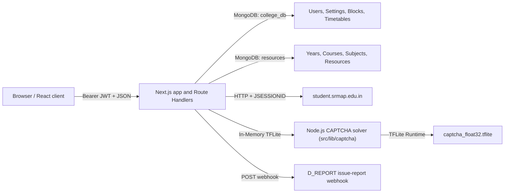

# Srmapi Next

Srmapi Next is a full-stack alternative portal for SRM AP students. It is a Next.js 16 application with a React client, Next.js Route Handlers as its backend, MongoDB for application data and dynamic learning resources, an in-house Node.js TFLite CAPTCHA solver, and a student Arcade suite. The backend signs in to `student.srmap.edu.in` on a student's behalf, keeps the SRM `JSESSIONID` in the browser for the current session, scrapes portal pages, normalizes the results, and caches selected data in MongoDB.

It is a third-party integration, not an official SRM service. SRM may change its HTML, session behavior, CAPTCHA format, or policies at any time; every scraper depends on the current portal markup.

## Contents

- [System map](#system-map)
- [Prerequisites and local setup](#prerequisites-and-local-setup)
- [How a login and data refresh work](#how-a-login-and-data-refresh-work)
- [Frontend](#frontend)
- [Backend API](#backend-api)
- [SRM scraper and CAPTCHA service](#srm-scraper-and-captcha-service)
- [Database and cache model](#database-and-cache-model)
- [Authentication, credentials, and security](#authentication-credentials-and-security)
- [Configuration, deployment, and operations](#configuration-deployment-and-operations)
- [Complete source map](#complete-source-map)

## System map



The browser never calls SRM directly. `src/lib/api/axiosClient.ts` adds the active account's JWT from local storage to every `/api` request. Route handlers authenticate that token, then use the supplied SRM session ID to make portal requests. The initial dashboard fetch also writes encrypted portal data to MongoDB so users can choose cached data when SRM is unavailable.

## Prerequisites and local setup

Use Node.js 22 or a current Node release supported by Next.js 16, and a reachable MongoDB instance. (No Python dependency required).

```bash
npm install
```

Create a `.env` file in the repository root.

```dotenv
NODE_ENV=development
MONGO_URI="mongodb://127.0.0.1:27017"
ACCESS_SECRET="replace-with-a-long-random-signing-secret"
ENCRYPT_SECRET="replace-with-an-encryption-secret"
ACCESS_EXPIRE=365
D_REPORT="https://example.invalid/webhook"
```

Start the application:

```bash
npm run dev
```

The web application runs on the Next.js development port (normally `http://localhost:3000`).

Available npm commands:

| Command | What it does |
| --- | --- |
| `npm run dev` | Starts Next.js development mode. |
| `npm run build` | Creates a production build using webpack. |
| `npm run start` | Serves the production build on port 3000. |
| `npm run lint` | Runs the configured Next/ESLint command. |
| `npm run faculty` | Converts `scripts/faculty/faculty.xlsx` to `src/static/faculty.json`. |

## How a login and data refresh work

1. The login page validates the registration number locally and sends `{ username, password, wantCachedData }` to `POST /api/auth/login`.
2. The handler uppercases and validates the registration number, rejects blocked users, and calls `handleUserSession`.
3. `src/server/auth/login.ts` loads SRM's login page, extracts `JSESSIONID` from `Set-Cookie`, downloads the CAPTCHA, solves it using the cached in-house TFLite model in `src/lib/captcha`, and posts the username, password, and predicted CAPTCHA to SRM. A missing `<h2>` in SRM's response is treated as failed login.
4. On success, the `JSESSIONID` is encrypted with the user password and written to `college_db.users`, with an India-time session date. The API returns a signed JWT plus the plain session ID and time to the browser.
5. The React `StudentDataProvider` calls `POST /api/srmapi/fetch` while the session date is current. It requests SRM's dashboard, attendance, timetable, subject, profile, and CGPA fragments concurrently, parses them with Cheerio, saves the result encrypted in MongoDB, saves at most ten daily encrypted attendance snapshots, and returns normalized data to the client.
6. The client stores the response data, session ID, and JWT in the active account record in browser `localStorage`; it populates the dashboard, attendance, timetable, profile, and subjects screens from that state.
7. If SRM is unreachable during a manual login and an encrypted database session can be decrypted with the entered password, the user is offered cached data. Cached mode sends no SRM session ID; `/api/srmapi/fetch` decrypts and returns stored data instead.
8. On a new day, `needsRefresh` causes the client to call `GET /api/srmapi/initiate/session`. The route reads the username and password from the JWT, logs into SRM again, updates the active account, and refreshes data.

Session validity is date-based, not a precise SRM expiry check: `isSessionValid` considers an India-time `yyyy-MM-dd` session timestamp valid only for the current calendar day.

## Frontend

The App Router root layout installs global CSS, analytics, toast notifications, a route progress indicator, error boundaries, and the provider tree:

`LocalStorageProvider -> AuthProvider -> StudentDataProvider -> ThemeProvider -> application`.

Authentication is client-side route gating. The public layout redirects a locally authenticated visitor to their selected startup page. The protected layout redirects unauthenticated visitors to `/login`, but permits unauthenticated access to `/`, `/privacy`, `/terms`, and `/aboutus` even though those files live under the protected route group.

### Browser storage and account switching

`settings` and `profile` are JSON values in `localStorage`.

- `settings` stores theme, sidebar visibility, timetable display preference, attendance sort preference, tutorial/explanation flags, and startup page.
- `profile.accounts` holds up to five accounts. Each account has `id`, `username`, `accessToken`, `sessionId`, `sessionTime`, `hasCachedData`, and client-side `data`.
- Legacy single-account values are migrated into `accounts` on startup. The active account is copied to the top-level compatibility fields.

### Rendering and route structure

The app uses the Next.js App Router under `src/app`. Routes split into:

- Public routes: `(public)/login`, `(public)/forgot`, landing at `(public)/page.tsx`. Authenticated visitors hitting these pages are redirected to `/dashboard` by `(public)/layout.tsx`.
- Protected routes: everything under `(protected)/*`. `(protected)/layout.tsx` validates local session state and mounts `DashboardLayout`.

| Route | Page File | Summary |
| --- | --- | --- |
| `/` | `(public)/page.tsx` | Landing page. |
| `/login` | `(public)/login/page.tsx` | Login, validation, cached-data prompt, and session creation. |
| `/forgot` | `(public)/forgot/page.tsx` | SRM password reset via CAPTCHA solve and OTP workflow. |
| `/dashboard` | `(protected)/dashboard/page.tsx` | High-level summary of attendance, timetable, and internals. |
| `/arcade` | `(protected)/arcade/page.tsx` | Arcade game center hub with Chess and Typing Test. |
| `/arcade/chess` / `/chess` | `(protected)/arcade/chess/page.tsx` | Interactive real-time & single-player Chess game. |
| `/arcade/typingtest` | `(protected)/arcade/typingtest/page.tsx` | Interactive typing speed and accuracy test. |
| `/attendance` | `(protected)/attendance/page.tsx` | Subject attendance, sorting/filtering, simulation, OD/ML adjustment, history, and detailed current attendance. |
| `/markattendance` | `(protected)/markattendance/page.tsx` | Sends an attendance code to SRM. |
| `/timetable` | `(protected)/timetable/page.tsx` | Weekly timetable, subject lookup, current-class logic, and subject dialog. |
| `/subjects` | `(protected)/subjects/page.tsx` | Displays scraped enrolled subjects and links to the published subject sheet. |
| `/cgpa` | `(protected)/cgpa/page.tsx` | Client-side CGPA calculator. |
| `/exams/internals` | `(protected)/exams/internals/page.tsx` | Fetches current internal assessment marks. |
| `/exams/past-internals` | `(protected)/exams/past-internals/page.tsx` | Lists historical semesters and fetches a selected semester's marks. |
| `/exams/semester-results` | `(protected)/exams/semester-results/page.tsx` | Displays parsed exam ledger rows and CGPA. |
| `/feedback` | `(protected)/feedback/page.tsx` | Retrieves SRM feedback subjects, proposes a random comment, and submits ratings/comments. |
| `/vacant` | `(protected)/vacant/page.tsx` | Queries available rooms by block, day, and time slot. |
| `/resources` | `(protected)/resources/page.tsx` | Dynamic study resource center with year/course/subject selector, file preview, and admin editor launch button. |
| `/calender` | `(protected)/calender/page.tsx` | Renders the static academic calendar (the route spelling is `calender`). |
| `/profile` | `(protected)/profile/page.tsx` | Displays scraped student profile data. |
| `/settings` | `(protected)/settings/page.tsx` | Theme/startup settings, local accounts, refresh, issue report, database-document viewer, and data deletion. |
| `/admin` | `(protected)/admin/page.tsx` | Admin dashboard with live stats, application controls, notifications, blocked users, and the full Resource Hub Management suite. |
| `/apps` | `(protected)/apps/page.tsx` | App/download presentation. |
| `/aboutus`, `/privacy`, `/terms` | protected route group | Public informational/legal pages. |

`DashboardLayout.tsx` is the shared navigation shell: desktop/mobile sidebars, top controls, account switching, theme controls, and navigation items. `components/page/*` contains feature-specific dialogs and views (attendance, feedback, settings, timetable, and admin resource editor); `components/ui/*` is the reusable Radix/Tailwind component layer; `hooks/*` contains UI state helpers.

## Backend API

All API responses are JSON. With the exception of `POST /api/auth/login` and `POST /api/auth/forgot`, every endpoint below requires `Authorization: Bearer <accessToken>`. `requireAuthResponse` verifies the token and checks the MongoDB blocked-user collection.

### Authentication and account data

| Method and route | Body/query | Behavior |
| --- | --- | --- |
| `POST /api/auth/login` | `username`, `password`, optional `wantCachedData` | Validates, checks blocking, logs in to SRM, upserts encrypted SRM session, and returns JWT/session details. |
| `POST /api/auth/forgot` | `type: "initiate"|"change"`, `username`; plus `newpass`, `otp` for change | `initiate` solves SRM CAPTCHA and asks SRM to send OTP. `change` validates new password and posts OTP/password to SRM's reset resource. |
| `DELETE /api/auth/delete` | `reason` | Requires a non-empty reason, then deletes this user's `college_db.users` document. |
| `GET /api/srmapi/initiate/session` | none | Re-authenticates against SRM using JWT claims and returns a new session ID/date. |
| `POST /api/srmapi/fetch` | optional `sessionId` | With valid current session plus ID, scrapes SRM, encrypts and stores normalized data, records daily attendance history, and adds timetable input for vacancy generation. |
| `GET /api/tools/document` | none | Returns the requesting user's complete MongoDB user document. |

### SRM attendance, marks, and feedback

| Method and route | Body | Behavior |
| --- | --- | --- |
| `POST /api/srmapi/attendance/details` | `sessionId` | Scrapes SRM's current-day attendance (`ids=33`). |
| `GET /api/srmapi/attendance/history` | none | Lists prior stored attendance snapshot dates. |
| `POST /api/srmapi/attendance/history` | `date`, optional `password` | Decrypts one historical snapshot. |
| `POST /api/srmapi/attendance/mark` | `sessionid`, `code` | Posts the attendance code to SRM. |
| `POST /api/srmapi/exams/internals` | `sessionId` | Scrapes current internal marks. |
| `POST /api/srmapi/exams/past-internals` | `sessionId`, optional positive integer `semester` | Lists available historic semesters; returns semester marks. |
| `POST /api/srmapi/exams/semester-results` | `sessionId` | Scrapes the exam ledger and CGPA. |
| `GET /api/srmapi/feedback/comment` | none | Selects a random static feedback comment. |
| `POST /api/srmapi/feedback/subjects` | `sessionId` | Scrapes feedback subjects/faculty metadata. |
| `POST /api/srmapi/feedback/submit` | `sessionId`, `comment`, `optionNo`, optional `selectedSubjectIds` | Checks feature toggle, submits ratings/comments for selected SRM subjects. |

### Dynamic Resources Hub (Database: `resources`)

| Method and route | Input | Behavior |
| --- | --- | --- |
| `GET /api/resources/courses` | `?year=` | Queries `resources.courses` for active courses in a year. |
| `GET /api/resources/subjects` | `?course=&year=` | Queries `resources.subjects` for subjects matching course code and year. |
| `GET /api/resources/resource` | `?course=&year=&subjectId=` | Queries `resources.resources` for question papers and notes attached to `subjectId`. |

### Rooms, notifications, settings, and reporting

| Method and route | Input | Behavior |
| --- | --- | --- |
| `GET /api/vacant` | `?block=&day=&slot=` | Ensures empty-room JSON is current, reads a requested slot, and enriches each room with a type from `ROOM_TYPES`. |
| `GET /api/sync` | none | Returns notifications and synced user settings from database. |
| `POST /api/sync` | `settings` | Updates synced user settings in database and returns updated settings and notifications. |
| `POST /api/tools/report` | `title`, `reason`, optional `time`, optional `id` | Checks title and user existence, then posts an embed to `D_REPORT`. |

### Administration (Database: `college_db` & `resources`)

The admin allowlist is hard-coded in `isAdmin` in `src/server/utils/functions.ts`; being an admin is also embedded as `admin: true` in the issued JWT.

| Method and route | Body | Behavior |
| --- | --- | --- |
| `GET /api/admin/check` | none | Confirms admin authorization. |
| `GET /api/admin/details` | none | Returns user counts, registrations, feedback status, blocked users, and notifications. |
| `POST /api/admin/block/add` | `username` | Blocks an existing non-admin user. |
| `POST /api/admin/block/remove` | `username` | Removes a blocked-user entry. |
| `POST /api/admin/notification/add` | `notification` | Creates an admin notification. |
| `POST /api/admin/notification/remove` | `notificationId` | Removes one notification by ObjectId. |
| `POST /api/admin/settings/toggle/:type` | `:type` (`feedback` \| `timetable`) | Toggles setting boolean (`feedback` or `timetableCollection`) in `settings/{id: "app-settings"}` using upsert. |
| `POST /api/admin/settings/reset/:type` | `:type` (`feedback` \| `timetable`) | Resets feedback count to zero in `settings/{id: "feedback"}` or clears cached timetable collection in `empty_classes`. |
| `GET /api/admin/resources/list` | optional `?year=&courseCode=&subjectId=` | Returns full hierarchy across `years`, `courses`, `subjects`, and `resources` with live counts. |
| `POST /api/admin/resources/courses` | `year`, `code`, `name` | Adds a new course branch. |
| `PUT /api/admin/resources/courses` | `id`, `year`, `code`, `name` | Updates a course and cascades code/year updates to subjects and resources. |
| `DELETE /api/admin/resources/courses` | `id` | Deletes a course and cascades deletions to subjects and resources. |
| `POST /api/admin/resources/subjects` | `courseCode`, `year`, `code`, `name` | Adds a new subject under a course and year. |
| `PUT /api/admin/resources/subjects` | `id`, `courseCode`, `year`, `code`, `name` | Updates subject code and name. |
| `DELETE /api/admin/resources/subjects` | `id` | Deletes a subject and cascades deletion to linked resource files. |
| `POST /api/admin/resources/resources` | `courseCode`, `year`, `subjectId`, `category`, `examType`, `title`, `size`, `fileType`, `downloadUrl` | Adds a new question paper or lecture slide. |
| `PUT /api/admin/resources/resources` | `id`, `courseCode`, `year`, `subjectId`, `category`, `examType`, `title`, `size`, `fileType`, `downloadUrl` | Updates resource file details. |
| `DELETE /api/admin/resources/resources` | `id` | Deletes a specific resource item. |

## SRM scraper and CAPTCHA service

### Portal requests and parsers

`createClient(sessionId)` creates an Axios client with an 8-second timeout, HTTP/HTTPS keep-alive agents, browser-like headers, and `Cookie: JSESSIONID=<sessionId>`.

### CAPTCHA solver

The CAPTCHA solver is implemented in Node.js within `src/lib/captcha/captcha.ts`. It loads the TFLite model from `src/static/captcha/model/captcha_float32.tflite` once at application startup. 

Because the model is cached in memory, each CAPTCHA solve takes ~2ms within Node.js, eliminating external network/HTTP overhead.

## Database and cache model

MongoDB stores core application state across two distinct databases:

### 1. `college_db` (Core Student & App State)

| Collection | Written/read by | Stored fields and purpose |
| --- | --- | --- |
| `college_db.users` | login, fetch, attendance history, tools document, deletion | `username`, `name`, `createdAt`, `session_id` (encrypted SRM ID), `session_time`, `data` (encrypted normalized portal payload), and up to 10 `{ date, data }` encrypted attendance snapshots. |
| `college_db.blocked` | auth guards/admin | `username`, `blockedAt`, `blockedBy`; used on login and every protected API call. |
| `college_db.notifications` | admin/tools | notification text, creation time, author; public notification response hides ID/author. |
| `college_db.settings` | feedback/timetable/admin | App settings toggles and reset counters. |
| `college_db.empty_classes` | fresh data fetch/vacancy generator | SHA-256-deduplicated timetable/profile data used to calculate occupied rooms. |

### 2. `resources` (Dynamic Study Materials Hub)

| Collection | Written/read by | Stored fields and purpose |
| --- | --- | --- |
| `resources.years` | admin resources / seed | `year`, `name`, `createdAt`, `updatedAt`. |
| `resources.courses` | admin resources, student resources reader | `year`, `code`, `name`, `createdAt`, `updatedAt`. |
| `resources.subjects` | admin resources, student resources reader | `courseCode`, `year`, `code`, `name`, `createdAt`, `updatedAt`. |
| `resources.resources` | admin resources, student resources reader | `courseCode`, `year`, `subjectId`, `category`, `examType`, `title`, `size`, `fileType`, `downloadUrl`, `createdAt`, `updatedAt`. |

## Authentication, credentials, and security

### Current credential design

This project intentionally includes the SRM password in the JWT payload:

```ts
createToken({ username, password, admin: isAdmin(username) })
```

### Existing controls

- Bearer-token signature/expiry validation on protected API routes.
- User blocklist checked on login and protected requests.
- Hard-coded server-side admin allowlist, with additional main-admin checks on settings and resource management.
- Request timeouts for portal Axios clients and CAPTCHA inference.
- Error responses can signal the client to remove its active local account.

## Configuration, deployment, and operations

`next.config.ts` enables React strict mode outside development, disables dev indicators, and configures Serwist only in production.

## Complete source map

| Path/group | Responsibility |
| --- | --- |
| `src/app/layout.tsx`, `globals.css`, `error.tsx`, `not-found.tsx`, `loading` files, `sitemap.ts`, `sw.ts` | Root document/providers/styles, global error/not-found/loading UX, sitemap, and service-worker source. |
| `src/app/(public)/*` | Landing, login, forgot-password pages and authenticated-user redirect layout. |
| `src/app/(protected)/*` | All authenticated app pages (dashboard, attendance, timetable, arcade, exams, feedback, vacant, resources, admin), loading layouts, and admin sub-layout. |
| `src/app/api/auth/*` | Login, SRM password reset, and user-document deletion. |
| `src/app/api/srmapi/*` | Session initiation, aggregate portal fetch, attendance, examinations, and feedback endpoints. |
| `src/app/api/admin/*` | Admin verification, metrics, blocks, notifications, application controls, and resource CRUD routes. |
| `src/app/api/resources/*` | Dynamic learning resources reader endpoints (`courses`, `subjects`, `resource`). |
| `src/app/api/vacant`, `api/tools/*`, `api/sync` | Room availability, user document viewer, issue reporting, and client settings synchronization. |
| `src/static/captcha/*` | Captcha TFLite model (`src/static/captcha/model/captcha_float32.tflite`) and path definition. |
| `src/lib/captcha/*` | In-house Node.js TFLite captcha solver module with in-memory caching and sharp preprocessing. |
| `src/server/auth/*` | SRM login exchange, encrypted session persistence/cached-login fallback, and bearer-token extraction. |
| `src/server/srmapi/fetchData.ts` | Concurrent SRM report fetch and Cheerio normalization of dashboard data. |
| `src/server/srmapi/exams/*` | SRM HTML parsers and per-user session-validity wrappers for internals, past internals, and ledger results. |
| `src/server/srmapi/feedback/*` | Feedback subject parser, static random comment reader, answer construction, and SRM submission. |
| `src/server/srmapi/utils/*` | Timetable projection for vacancy data and current-day attendance parser. |
| `src/server/utils/*` | SRM headers/agents, API error helpers, JWT/auth/crypto/retry functions. |
| `src/server/faculty/faculty.ts` | Normalizes faculty names and looks up cabin locations in static faculty data. |
| `src/server/vacant/*` | Builds and freshness-controls the empty-classroom matrix. |
| `src/context/*` | React contexts for auth, browser storage/accounts, student data, theme, and admin state. |
| `src/hooks/*` | Custom hooks for navigation, mobile detection, timetable dialogs/maps, toasts, and session validity. |
| `src/lib/api/axiosClient.ts` | Browser API client, JWT injection, and forced-logout/blocked-response handling. |
| `src/lib/database/*` | Singleton MongoDB connector and its alias. |
| `src/components/layouts/*` | Dashboard navigation shell (`DashboardLayout.tsx`) and modular layout sub-components. |
| `src/components/page/admin/*` | Admin Resource Hub components (`ResourceEditor`, `ResourceCard`, `ResourceFormDialog`, `ResourceDeleteConfirm`). |
| `src/components/page/*` | Attendance dialogs/card, feedback info dialog, landing/download components, settings report form, and timetable subject dialog. |
| `src/components/ui/*` | Reusable Tailwind/Radix primitives (Dialog, Button, Card, Tabs, Select, Badge, Input, WarningPopup). |
| `src/types/server/resource.ts` | Database models & client interface definitions for courses, subjects, and study materials. |
| `src/validators/srmapi/resource.ts` | Course, subject, and resource input validation functions. |
| `src/static/*` | Academic calendar, feedback phrases, faculty cabins, and generated vacancy JSON. |
| `public/*` | PWA icons/manifest, robots instructions, screenshots, and developer images. |